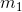
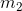
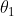
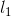
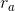
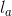
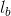
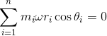
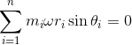
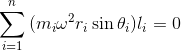

## INTRODUCTION 

#### Learning Objectives:

1. To balance the system.
2. To study the steps involved in balancing the rotating bodies.
3. To apply the mathematical equations acting on the rotating body.
4. To verify the calculated values with the simulation.
5. To evaluate how the change in mass and position can improve the balance of the rotating body.

#### Theory

In most of the machine, the rotating components are very common. For any given rotating component, it is required that the centre of gravity coincides with the axis of rotation. However, this may not always be the case due to various factors such as manufacturing defects, wear and tear, environmental conditions, addition of parts etc., which causes eccentricity. The eccentricity results in vibrations within the component and may finally cause failure. This eccentricity in the rotating component is considered to be unbalance in force and moment, and should be balanced by additional forces and moments leading to minimum vibration.<a href="references.html">[1]</a>

The balancing of rotating mass in multiple plane along the length of a shaft is a particular case of unbalance. An experiment is carried out to calculate additional masses required for balancing the unbalanced force and moment and their angular position. The purpose of the experiment is to take an unbalanced system with rotating masses and adjust the radii of the two outer masses, calculate their mass and angular positions in order to achieve a balanced system.<a href="references.html">[1]</a>

Consider  and  to be the unbalanced masses of a rotating shaft with distances  and  from its axis of the rotation, as shown in Fig 1. The angle between them is  and distance between their planes is . If  and  are the given distances of the balancing masses from the axis of rotation,  and  are the distances of their rotating planes from the plane of mass , then the balancing masses  and  can be calculated by considering force and moment equilibrium, assuming that the rotational speed '' of the shaft is constant.

  

Fig 1. Experimental setup describing masses and their distance from the center 

For balancing of masses, the sum of all the forces and moments should be equal to zero.

(i) Forces:

(ii) Moment:

 

 <a href="references.html">[1]</a>
 

(Equation Generation Source: <a href="http://latex.codecogs.com/">latex.codecogs.com</a>)

