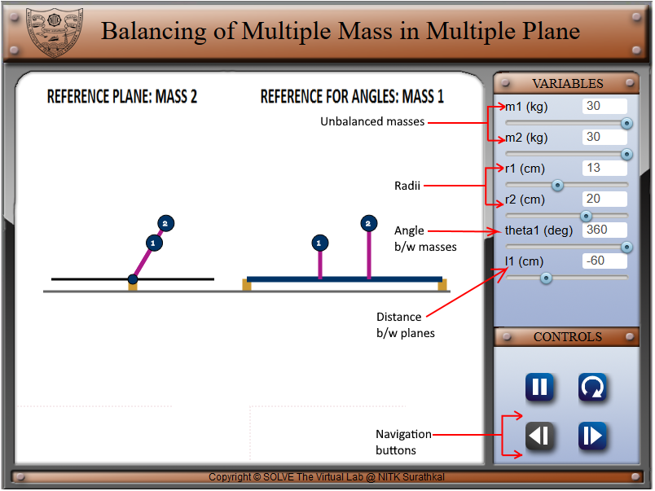
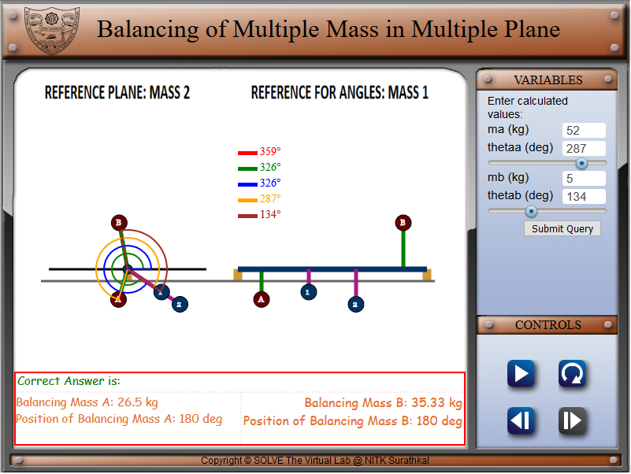

#### These procedure steps will be followed on the simulator

1. In the simulation window, the front view and side view of a rotating shaft with two unbalanced masses in different planes are displayed. 
2. There are sliders given on right side of the screen sets the values of input variables, viz., two unbalanced masses on the shaft (m1, m2), their radii of rotation (r1, r2), relative angular position (theta1) and distance between their planes (l1). . After setting these variables, the navigation button at the bottom right corner moves onto the next segment. 
    

3. After moving on to the next pane, the radii and positions of the balancing masses have to be entered by adjusting the slider. After setting the values, it is required by the user to calculate the values for balancing masses and their angular position. 
    

4. Once the values of masses and their angular position from the previous step are calculated, the user needs to navigate to the next pane, enter the values in the boxes provided, the balanced masses with their angular positions is displayed instantly. 
    

5. Click on the submit button to submit the results and press play/pause button to pause the simulation and clicking on the direction change button, reverses the direction of rotating masses. 
    

6. Further, it can be noted that, the correct values of balancing masses and their angular positions as calculated by the system is also displayed at the bottom of the simulation window. 
    
